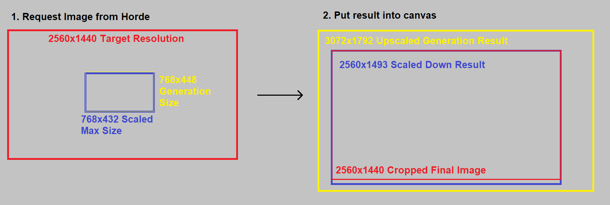

# krita-stable-diffusion

This repository includes a Krita plugin for communication with [AIhorde](https://aihorde.net). Stablehorde is a cluster of stable-diffusion servers run by volunteers. You can create stable-diffusion images for free without running a colab notebook or a local server. Please check the section "Limitations" to better understand where the limits are.

Please check HISTORY.md for the latest changes. 

## Installation
### Krita

The plugin has been tested in Krita 5.1.3

**IMPORTANT:** If you are running Linux, please make sure, you have webp support for Qt5 installed, as this is the image format stablehorde uses. Execute the following command to check, if it's already supported: ```python -c "from PyQt5.Qt import *; print([bytes(x).decode('ascii') for x in QImageReader.supportedImageFormats()])"```. To install it, use ```sudo pacman -S qt5-imageformats``` (Arch) or ```sudo apt install qt5-image-formats-plugins``` (Debian).

1. Download the repository as a zip.

2. Copy the krita_AIhorde.py file and krita_AIhorde folder into your Krita plugin folder. The plugin folder is located at:
   - Windows: ```C:\Users\<username>\AppData\Roaming\krita\pykrita```  
   - Linux: ```~/.local/share/krita/pykrita```  
   - MacOS: ```~/Library/Application Support/krita/pykrita```  
   (Linux and MacOS locations were hallucinated by an AI, those locations might not be real. If you know the correct locations, please let me know.)  

3. Start Krita. Go to Settings > Configure Krita > Python Plugin Manager. You should see the "Krita AI Horde" plugin in the list. Enable it and restart Krita.  

4. Enable Settings > Dockers > AI Horde. The docker should appear on the left side.  

5. [OPTIONAL] Settings > Dockers > Log Viewer, and click the "enable logging" button on it to see the debug info from the plugin.

## Generate images
1. Start Krita and create a new document with color mode "RGB/Alpha" (default), color depth 8bit (default) and a paint layer.

2. Open the AI Horde docker if it is not on already. Enter your API key. If you don't have an API key, you can get one for free at [AIhorde](https://aihorde.net). This only needs to be done once, and will be saved for future sessions.

3. Select a model from the list. They will be ordered based on the number of active workers available for the request, with more popular models at the top. Models without many workers may take longer to generate an image, since they often need to load the model from disc first.

4. Enter a prompt, and hit Generate. Optionally, you can select a region of the canvas to generate in. If you do not make a selection, then the generated image will be a square in the center of your document with resolution equal to your selected minimum size.

**New Inpainting Interface**
1. Generate an image normally. Select an area of the image and click the "Mask" button. This will create a new layer with the mask and change your tool to the Brush. USE WHITE FOR INPAINTING: Currently the mask works by conversion to a Transparency layer after generation, so White is opaque, and Black is transparent. 

2. Hit the Inpaint button to generate a new image based on the mask. This actually sends the image through the Img2Img pipeline, so denoise values above 0.5 will have visible seams.

3. The resulting images should have transparency masks applied to them when they display. You can edit the transparency mask layers to change the inpainting area after generation, or arrange them to combine multiple results. This is especially helpful when inpainting multiple subjects in a crowd.

**Postprocessing Workflow Tips**
Images post-processed with upscalers will return a larger image than the generation area, but the interface compressess all images to the generation area. For best effect, use the following method:  
1. Select a large area of the canvas to generate in. Alternatively, CTRL+A to select the entire space if your canvas is already the size of your intended output.

2. Set the Max Resolution slider to be 1/2 or 1/4 of the size of your selected area, depending on the upscaler you choose.

3. Generate the image. The resulting image will be larger than the generation area, but will be compressed to fit the generation area. If your selection is larger than 2x the max resolution, and you use a 2x upscaler, then the resulting image will be expanded (with some anti-aliasing) to fit.

4. Go back and inpaint the subjects of the image to improve their details. For best results, use selections under 768x768 for each step.

**Basic Tab (OUTDATED. WILL FIX IN FUTURE)**

   - **Denoising:** How much the AI should change the current image (when using img2img). Actually affects the generative steps and starting point; a value of 0.3 will set up the stable diffusion pipeline with the input image and only "complete" the last 30% of the denoising process.

   - **Seed:** This parameter is optional. If it is empty, a random seed will be generated on the server. If you use a seed, the same image is generated again in the case the same parameters for init strength, steps, etc. are used. A slightly different image will be generated, if the parameters are modified. You find the seed as part of the layer name of the layer, where the generated image is displayed. 

   - **Prompt:** How the generated image should look like.

   - **Negative Prompt:** What subjects the generated image should avoid.

   - **Post Processing:** Face Fixer and background removal options. Facefixer Strenth will apply if a selection is made.

   - **Upscaler:** Post process upscaler. Will use the selected upscaler to return a larger image than was requested.

   - **Generate:** Start image generation. The values you inserted into the dialog will be transmitted to the server, which dispatches the request now to one of the stable-diffusion servers in the cluster. Your generation request is added to the queue. You will see now the status "Queue position..." and all input elements of the dialog are disabled. Generation can take between several seconds and several minutes depending on how many other requests are already in the queue and how many stable diffusion servers joined currently the cluster.<br>When the image has been generated successfully, it will be shown as a new layer of the opened document. The used seed is shown as a part of the name of the new layer. If an error during generation occurs, the error message will be shown in the status textarea and all input elements will be enabled again.

   - **Cancel:** Stop waiting for results and enable docker inputs again. Usefull if something breaks. If you cancel when you already started generation, generation will be stopped.

**Advanced Tab**

   - **Prompt Strength:** How much the AI should follow the prompt. The higher the value, the more the AI will generate an image which looks like your prompt. 8 is a good value to use.

   - **Steps:** How many steps the AI should use to generate the image. The higher the value, the more the AI will work on details. But it also means, the longer the generation takes and the more the GPU is used. 50 is a good value to use.

   - **API key:** This parameter is optional. If you don't enter an API key, you run the image generation as anonymous. The downside is, that you will have then the lowest priority in the generation queue. For that reason it is recommended registering for free on [AIhorde](https://aihorde.net) and getting an API key.

   - **Max Wait:** The maximum time in minutes you want to wait until image generation is finished. When the max time is reached, a timeout happens and the generation request is stopped.

   - **CLIP Skip:** BROKEN? RESULTS FROM HORDE ARE NOT AFFECTED AT THIS TIME. Should skip the last few layers of the CLIP language translation model, effectively getting more consistent results with less precision. May improve some models that were trained with clip skip 2.

   - **NSFW:** If you want to send a prompt, which is excplicitly NSFW (Not Safe For Work). 
   - If you flag your request as NSFW, only servers which accept NSFW prompts work on the request. If you don't flag the prompt, but it is NSFW, you will receive a black image.
   - If you didn't flag your request as NSFW and don't prompt NSFW, you will receive in some cases a black image, although it's not NSFW (false positive). Just rerun the generation in that case.

   - **Karras:** Magic. Improves generation with fewer steps.  

   - **Share With LAION** Share your prompt with the LAION database for research and model tuning. If shared, the generation will cost less kudos.  

## Troubleshooting
### Linux
- Please make sure, you have webp support for Qt5 installed, as this is the image format stablehorde uses. Execute the following command to check, if it's already supported: ```python -c "from PyQt5.Qt import *; print([bytes(x).decode('ascii') for x in QImageReader.supportedImageFormats()])"```. To install it, use ```sudo pacman -S qt5-imageformats``` (Arch) or ```sudo apt install qt5-image-formats-plugins``` (Debian).

## Limitations

   - **Generation speed:** Stablehorde is a cluster of stable-diffusion workers run by volunteers. The generation speed depends on how many workers are in the cluster, which hardware they use and how many others want to generate with stablehorde. The upside is, that stablehorde is free to use, the downside that the generation speed is unpredictable.

   - **Privacy:** The privacy stablehorde offers is similar to generating in a public discord channel. So, please assume, that neither your prompts nor your generated images are private.
   
   - **Features:** Currently text2img, img2img and inpainting are supported. See FeaturePlan.md for a list of planned and available features.

## FAQ
**Why does the log show larger generations than the selected area?** Stable Diffusion only generates image sizes which are a multiple of 64. This plugin rounds up. If your selection has a size of 650x512, the generated image will have a size of 704x512. When you make a selection and attempt to generate, the plugin will scale the selection to the min/max size boundaries in your settings before finding the next multiple 64 that can be used for both dimensions. When an image is returned from the server, it could be a very different size than the selection depending on the settings used. In that case, it will be scaled to encompass the selection size before cropping to only display the intended area.  


**How do I report an error or request a new feature?** Please open a new issue in this repository.
